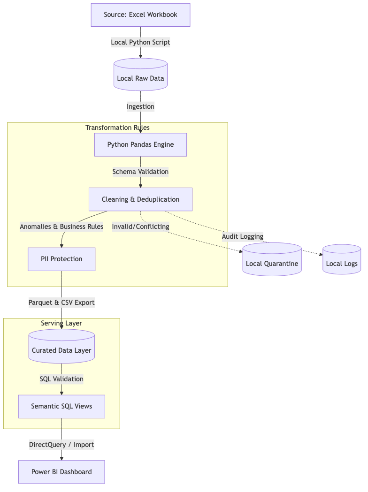
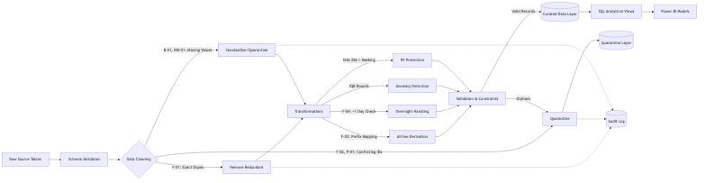
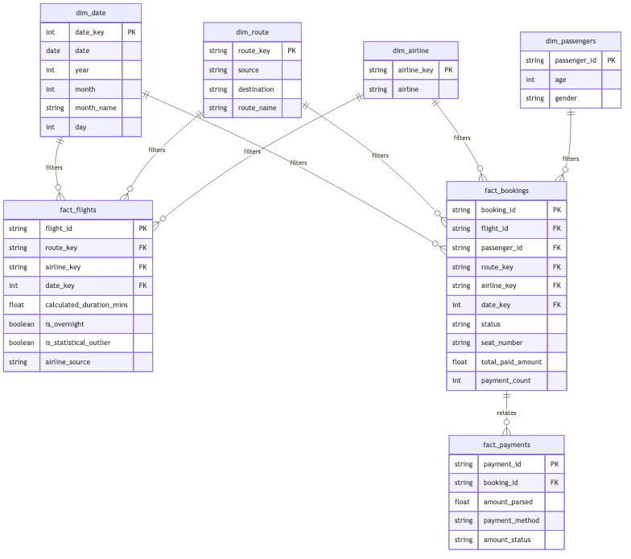
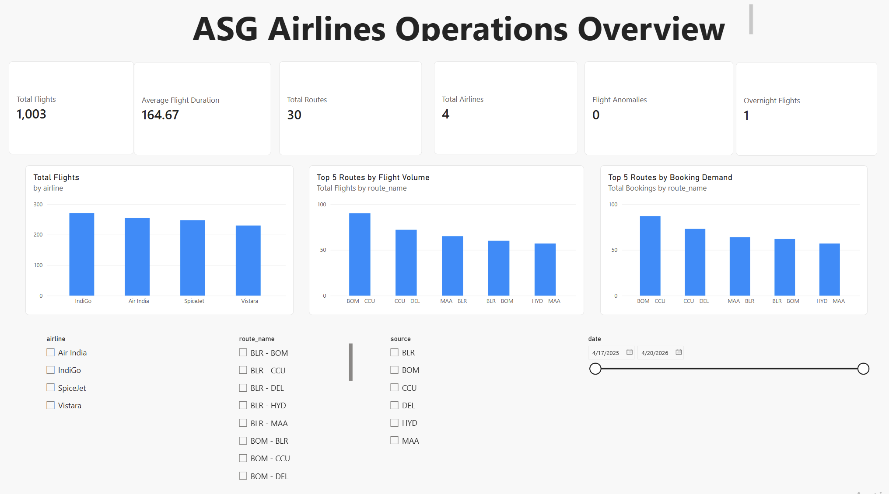

# ASG Airlines — End-to-End Data Engineering

## Problem
ASG Airlines faced operational data inconsistencies across booking, scheduling, and airport data sources. These inconsistencies affected KPI calculation and operational reporting.

## Solution
A data engineering pipeline that ingests operational data, applies traceable data quality rules, hashes/masks passenger PII, and outputs a physical Star Schema for Power BI reporting.

## Architecture (Implemented locally, cloud-ready)
- **Processing**: Python (Pandas)
- **Storage**: Local Parquet & CSV files
- **Analytical Layer**: SQL scripts for validation and analytical queries
- **Reporting**: Power BI using the curated analytical outputs

*Note: The pipeline was designed to be easily migrated to Azure (ADF, Databricks, Synapse) for future cloud deployment.*



## Tech Stack
- Python (Pandas dataframes)
- SQL (Analytical and data-quality queries)
- Power BI (DAX / Visualization)

## Data Quality
- **Flights**: Handled exact duplicates (15 removed), quarantined conflicting IDs (2 records), derived missing airlines via prefix mapping (67 derived), safely parsed overnight flights (1 adjusted).
- **Passengers**: Resolved 39 redundant duplicate rows (retained first occurrence safely as age/gender were identical). Sensitive passenger fields were hashed, masked, or excluded from the final analytical layer based on their analytical necessity.
- **Bookings & Payments**: Missing and invalid booking statuses were retained as explicit categories, while invalid or missing payment amounts were handled separately during financial data preparation.

## Pipeline Flow


## Analytical Model


## KPIs
- Average Flight Duration
- Route-wise Traffic (Flight Volume vs Booking Demand separated)
- Flight Distribution by Airline

## Dashboard Overview

- Flight Anomalies (Statistical Outliers via IQR)

## Power BI
The Power BI model correctly filters operational volumes separately from passenger demand.
Power BI report with 5 analytical pages and a dedicated data-model/relationship view.

- [Operations Overview](powerbi/screenshots/operations_overview.png)
- [Duration Analysis](powerbi/screenshots/duration_analysis.png)
- [Route Performance](powerbi/screenshots/route_performance.png)
- [Airline Trends & Data Quality](powerbi/screenshots/airline_quality.png)
- [Delay & Anomaly Insights](powerbi/screenshots/delay_anomaly_insights.png)

Power BI also includes a separate [Data Model / Relationship view](powerbi/screenshots/model.png) used to document and verify the analytical model.

[Power BI Dashboard File](powerbi/ASG_Airlines_Operations.pbix)

## Repository Structure
```
├── README.md
├── data/
│   ├── raw/
│   └── processed/
│       ├── curated/       (Analytical Star Schema outputs)
│       └── logs/          (Audit trails)
├── notebooks/
│   └── ASG_Airlines_Data_Engineering.ipynb  (Core Python Pipeline)
├── sql/                   (Semantic Views)
├── diagrams/              (Architecture, DFD, Model)
├── docs/                  (Detailed Documentation)
└── powerbi/               (Dashboards & Screenshots)
```

## How to Run
The original source workbook is excluded from the public repository because it contains personally identifiable information (PII). Place the provided workbook at `data/raw/UseCase - Airlines.xlsx` locally before running the pipeline.

1. Place the supplied source workbook at:
   `data/raw/UseCase - Airlines.xlsx`

2. Install dependencies:
   `pip install -r requirements.txt`

3. Run:
   `notebooks/ASG_Airlines_Data_Engineering.ipynb`
   or
   `src/pipeline.py`

4. Outputs are written to:
   `data/processed/curated/`

## Results
- Total Flights: 1,003
- Total Bookings: 998
- Flight Anomalies: 0

## Documentation
- [Detailed Case Study Report](docs/case_study_report.md)

## Dashboard
*Screenshots available in `powerbi/screenshots/`.*

## Limitations
- Source data lacked scheduled vs actual timestamps, preventing the calculation of conventional delay minutes.

## Future Improvements
- Acquire scheduled arrival timestamps for explicit delay calculations.
- Implement CI/CD for the data pipeline.
