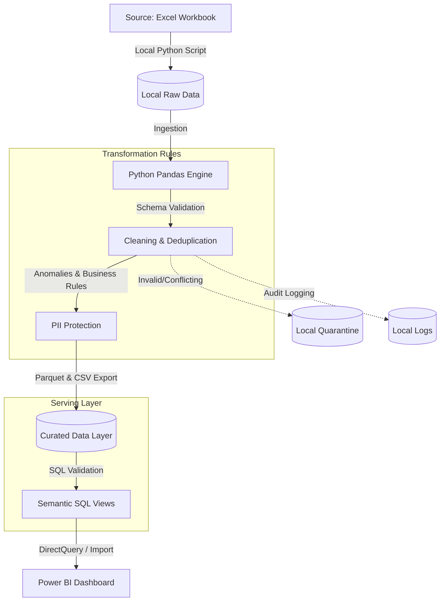

# ASG Airlines — Architecture Diagram

```mermaid
flowchart TD
    A[Source: Excel Workbook] -->|Local Python Script| B[(Local Raw Data)]
    B -->|Ingestion| C[Python Pandas Engine]
    
    subgraph "Transformation Rules"
        C -->|Schema Validation| C1[Cleaning & Deduplication]
        C1 -->|Anomalies & Business Rules| C2[PII Protection]
    end
    
    C1 -.->|Invalid/Conflicting| Q[(Local Quarantine)]
    C1 -.->|Audit Logging| L[(Local Logs)]
    
    C2 -->|Parquet & CSV Export| D[(Curated Data Layer)]
    
    subgraph "Serving Layer"
        D -->|SQL Validation| E[Semantic SQL Views]
    end
    
    E -->|DirectQuery / Import| F[Power BI Dashboard]
```
