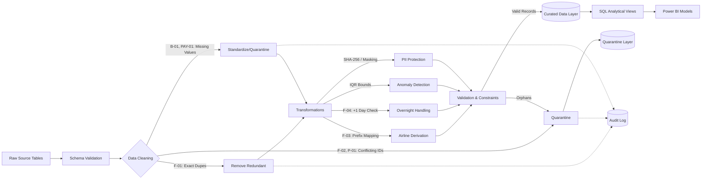

# ASG Airlines — Data Flow Diagram

```mermaid
flowchart LR
    A[Raw Source Tables] --> B[Schema Validation]
    
    B --> C{Data Cleaning}
    C -->|F-01: Exact Dupes| C1[Remove Redundant]
    C -->|F-02, P-01: Conflicting IDs| C2[Quarantine]
    C -->|B-01, PAY-01: Missing Values| C3[Standardize/Quarantine]
    
    C1 --> D[Transformations]
    C3 --> D
    
    D -->|F-03: Prefix Mapping| D1[Airline Derivation]
    D -->|F-04: +1 Day Check| D2[Overnight Handling]
    D -->|IQR Bounds| D3[Anomaly Detection]
    D -->|SHA-256 / Masking| D4[PII Protection]
    
    D1 --> E[Validation & Constraints]
    D2 --> E
    D3 --> E
    D4 --> E
    
    E -->|Orphans| C2
    E -->|Valid Records| F[(Curated Data Layer)]
    
    F --> G[SQL Analytical Views]
    G --> H[Power BI Models]
    
    C2 --> Q[(Quarantine Layer)]
    C1 -.-> L[(Audit Log)]
    C2 -.-> L
    C3 -.-> L
```
