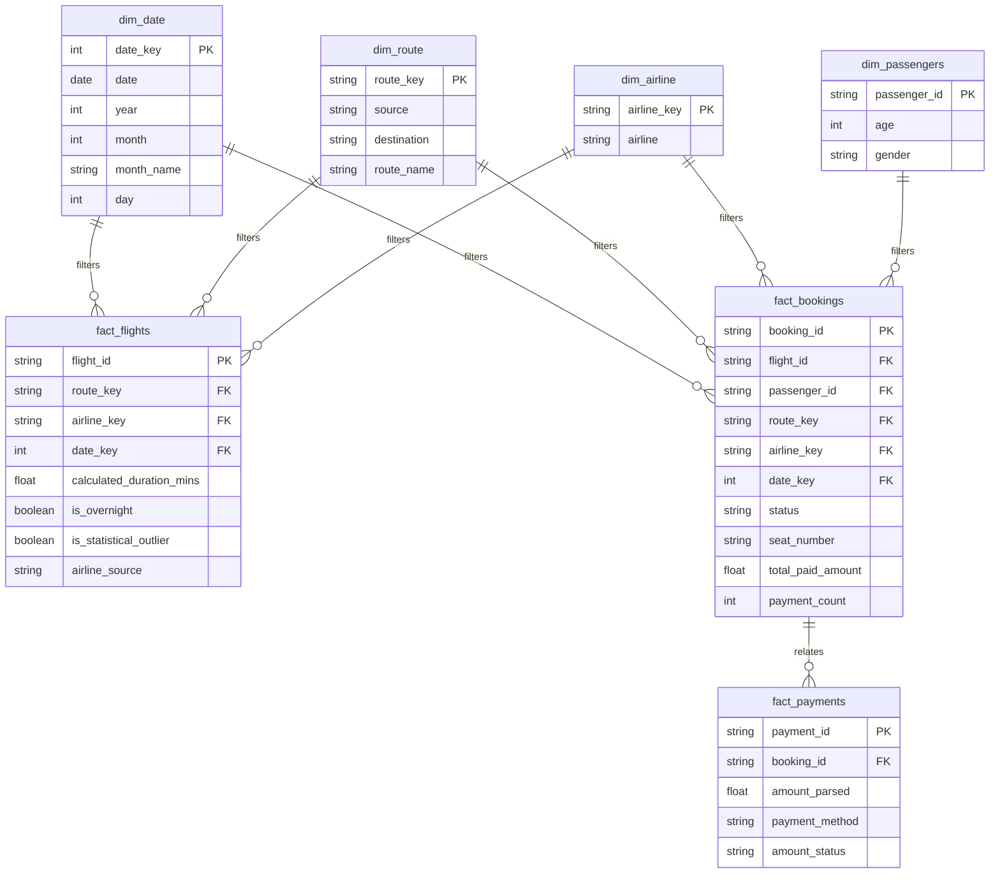

# ASG Airlines — Data Model Diagram

```mermaid
erDiagram
    dim_date {
        int date_key PK
        date date
        int year
        int month
        string month_name
        int day
    }
    
    dim_route {
        string route_key PK
        string source
        string destination
        string route_name
    }
    
    dim_airline {
        string airline_key PK
        string airline
    }
    
    dim_passengers {
        string passenger_id PK
        int age
        string gender
    }

    fact_flights {
        string flight_id PK
        string route_key FK
        string airline_key FK
        int date_key FK
        float calculated_duration_mins
        boolean is_overnight
        boolean is_statistical_outlier
        string airline_source
    }
    
    fact_bookings {
        string booking_id PK
        string flight_id FK
        string passenger_id FK
        string route_key FK
        string airline_key FK
        int date_key FK
        string status
        string seat_number
        float total_paid_amount
        int payment_count
    }
    
    fact_payments {
        string payment_id PK
        string booking_id FK
        float amount_parsed
        string payment_method
        string amount_status
    }

    dim_date ||--o{ fact_flights : "filters"
    dim_date ||--o{ fact_bookings : "filters"
    dim_route ||--o{ fact_flights : "filters"
    dim_route ||--o{ fact_bookings : "filters"
    dim_airline ||--o{ fact_flights : "filters"
    dim_airline ||--o{ fact_bookings : "filters"
    dim_passengers ||--o{ fact_bookings : "filters"
    fact_bookings ||--o{ fact_payments : "relates"
```
